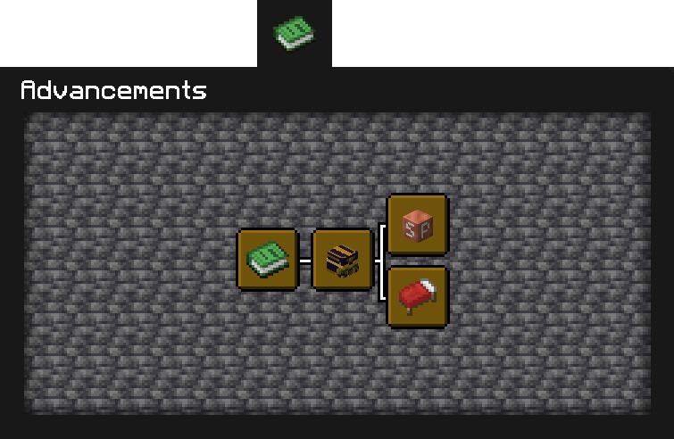
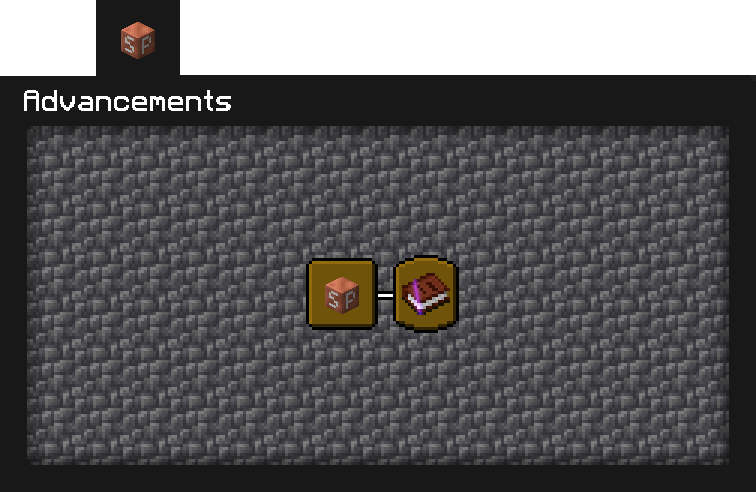

# Documentation for the STEAMPUNK server's advancements

There is 2 advancements pages :

1. SD
2. SteamPunk

## __I). SD__

> SD stands for Server's Datapacks

This advancement page's purpose is to see which datapacks (made by me) are installed on the server

## __II). SteamPunk__

This page contains the challenges that player will be able to do

