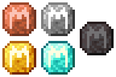

# Documentation for the Resource Pack

> The pack is divided in 4 folders :
>
> 1. cim
> 2. cyan
> 3. minecraft
> 4. steampunk

## __I). CIM__

> _CIM stands for Custom Item Model_

This part contains the custom textures used for Milys and books\

## __II). Cyan__

> Contains the translation files for the cyan mod (which is present on the server)

## __III). Minecraft__

Contains :

- the translation files for the cyan mod (for the advancements)
- the custom models (for the steampunk datapack)

## __IV). SteamPunk__

Contains translation files for the SteamPunk datapack
